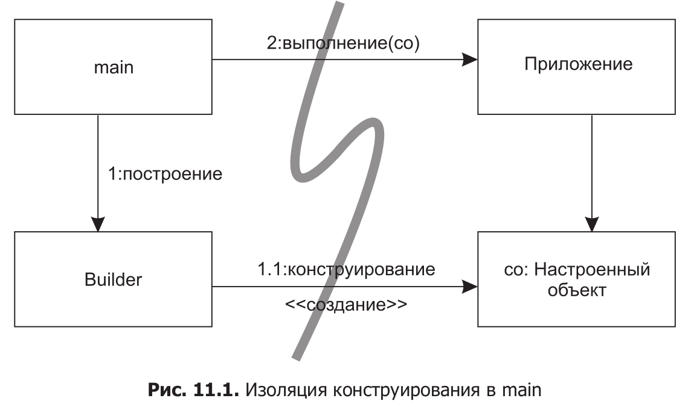
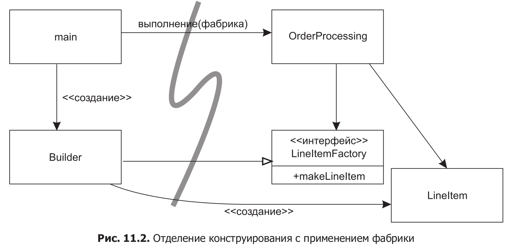
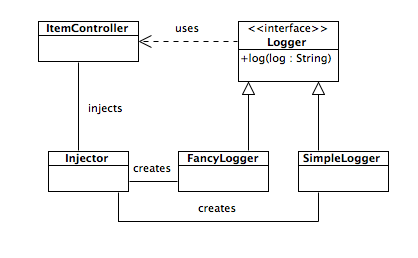

Группы разработки программного обеспечения тоже организуются по аналогичным принципам, но системы, над которыми они работают, часто не имеют аналогичного разделения обязанностей и уровней абстракции

## Фаза ==инициализации== (конструируются объекты приложения и «склеиваются» основные зависимости)
### Cпособов отделения конструирования от использования:
1. ==перемещении всех аспектов конструирования в main==

> Функция
main строит объекты, необходимые для системы, а затем передает их приложению, которое их просто использует.
2.  ==АБСТРАКТНАЯ ФАБРИКА==
> приложение могло само выбрать момент для создания/инициации обьектов класссов (конкретных или по реализации интерфейса)<br>
> приложение изолировано от подробностей построения LineItem, об этом знает только клас-фабрика **LineItemFactoryImplementation**

3. ==Внедрение зависимостей (DI, Dependency Injection)==
> перемещает **вторичные обязанности объекта в другие объекты**, созданные специально для этой цели, тем самым способствуя соблюдению принципа единой ответственности
> 
> В контексте управления зависимостями **объект не
должен брать на себя** ответственность за **создание экземпляров зависимостей**.
> 
> **передает эту обязанность** другому «уполномоченному» механизму (либо функция **main , либо** специализированный **контейнер**)


***
Возможность построить **«правильную систему с первого раза» — миф**. 

Вместо этого мы **сегодня реализуем текущие потребности**, а **завтра перерабатываем и расширяем систему для реализации новых потребностей**. В этом ==заключается суть итеративной, пошаговой гибкой разработки==. Разработка через тестирование, рефакторинг и полученный в результате их применения чистый код обеспечивают работу этой схемы на уровне кода.
***
## ==Агрессивная, «всепроникающая» архитектура== скрывает логику предметной области и ==снижает гибкость==
> ошибкам проще спрятаться в коде, а разработчику труднее реализовать пожелания пользователей

## ==Намерения== разработчика должны быть четко ==выражены на всех уровнях абстракции== ==> создает ==POJO-объекты==

```
function CarData(make, model, year, condition) {
    this.make = make;
    this.model = model;
    this.year = year;
    this.condition = condition;
}
var myToyotaCorolla = new CarData('Toyota', 'Corolla', 2014, 'new');
console.log(myToyotaCorolla.make);  // -> 'Toyota'
```

